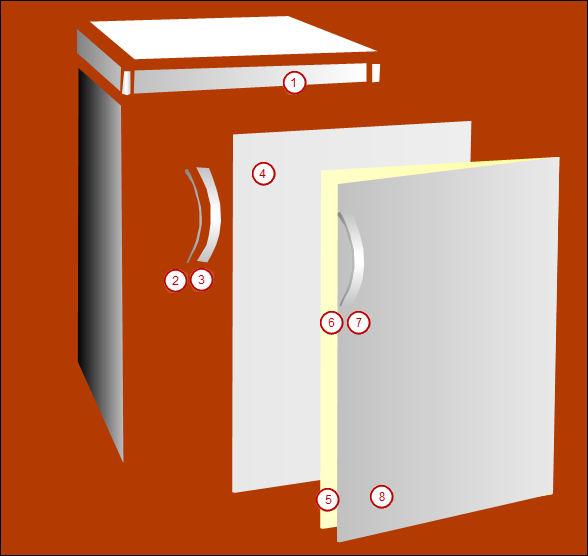
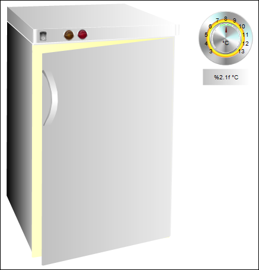

# Structure of the `Live-Visu` visualization

This screen includes the representation of a refrigerator. The refrigerator consists of several polygon type visualization elements. The doors of the refrigerator are drawn in both the closed and open states. Both doors consist of a group of single elements.

1. Open the visualization `Live_Visu` in the editor.
2. Reduce the elements and position them on the refrigerator.

   * 

17.0

© Copyright 2026, CODESYS GmbH