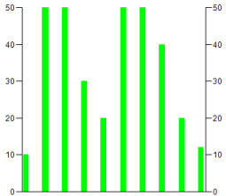

# Setting element properties for the histogram

**Requirements**

* A project contains a visualization object and a program.
* A one-dimensional array is declared in the program (example: `histogram : ARRAY[1..10] OF INT;`).
* In the program, data is assigned to the `histogram` array (example: within the range from `0` to `50`).

1. In the device tree, double-click the **[visualization](_visu_f_reference_ui_objects_visu_and_visueditor.html#_visu_f_reference_ui_objects_visu_and_visueditor)** object.
2. If the project has been compiled without errors, then click the **Online** → **Login** command and then click the **Debug** → **Start** command to start the application.

   * The histogram is displayed in the visualization as follows:

     

For more information, see the following: Element: [Visualization Element: Histogram](_visu_elem_histogram.html#_visu_elem_histogram)

17.0

© Copyright 2026, CODESYS GmbH