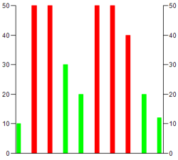

# Defining alarm colors for the histogram

The visualization displays a histogram with bars all the same color (example: green). Now you want the bars with values less than `30`, for example, to be displayed in another color (example: red).

1. Select the **Colors** → **Alarm color** element property.
2. If the project has been compiled without errors, then click the **Online → Login** command and then click the **Debug** → **Start** command to start the application.

   * In the example histogram, all bars with values greater than `30` are displayed in red.

     

17.0

© Copyright 2026, CODESYS GmbH