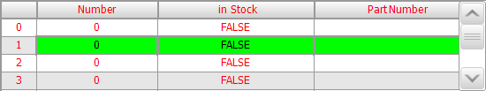

# Tutorial: Displaying Array Variables in Tables

A frequently required function of a user interface is the display of data arrays. CODESYS Visualization provides the [Visualization Element: Table](_visu_elem_table.html#_visu_elem_table) element for this purpose.

In the configuration of the **Table** element, you specify an array variable in the **Data array** property. The array elements are displayed in the rows and columns of the table.

Subsequent instructions describe an example of how an array of a structure is displayed in a table. As a preparation, create the `MYSTRUCT` DUT and the declarations in the `PLC_PRG` program.

```
TYPE MYSTRUCT :
STRUCT
    iNo : INT;
    bOnStock : BOOL;
    strPartNumber : STRING;
END_STRUCT
END_TYPE
```

```
PROGRAM PLC_PRG
VAR
    arrStruct : ARRAY[0..6] OF MYSTRUCT;
    iSelectedColumn : INT;
END_VAR
```

1. Drag the **Table** visualization element to the visualization editor.
2. In the **Selection** → **Variable for selected row** property, define the `PLC_PRG.iSelectedColumn` variable.

   * The following display results in online mode:

     

17.0

© Copyright 2026, CODESYS GmbH