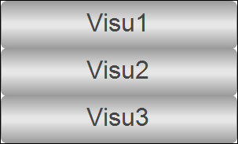

# Creating a menu bar

The menu bar has three menu items. A visualization screen is displayed by clicking the corresponding menu item.

1. Insert a **Visu\_Menu** visualization below the application.
2. Edit the button properties of `Visu2` (P`LC_PRG.iSelection = 1`) and `Visu3` (`PLC_PRG.iSelection = 2`).

   * Result:

     

17.0

© Copyright 2026, CODESYS GmbH