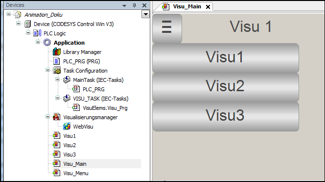

# Create the main visualization page

On this screen, you can see the menu bar and a button to show or hide the menu bar. The different visualization screens are navigated in a **[Frame](_visu_elem_frame.html#_visu_elem_frame)** visualization element.

1. Open the properties of the **Visu\_Main** visualization. In the **[Visualization](_visu_dlg_object_properties.html#_visu_dlg_object_properties)** tab, set the **Visualization size** to a **Width** of 800 and a **Height** of 600.
2. Set the property value of **Animation duration** to `2000`.

   * Result:

     

17.0

© Copyright 2026, CODESYS GmbH