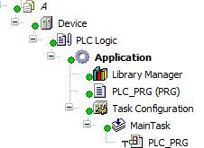

# Import the project into the SVN repository.

1. Open the CODESYS project that you want to save in the SVN repository.

   * Example: `A.project` is open.
2. Specify an import message (example: **Project for Customer A**) and click **OK**.

   * The project is saved in SVN. [Overlaid icons](_svn_reference_overlay_symbols.html#_svn_reference_overlay_symbols) show the SVN status in the object path of CODESYS.

     

6.0

© Copyright 2025, CODESYS GmbH