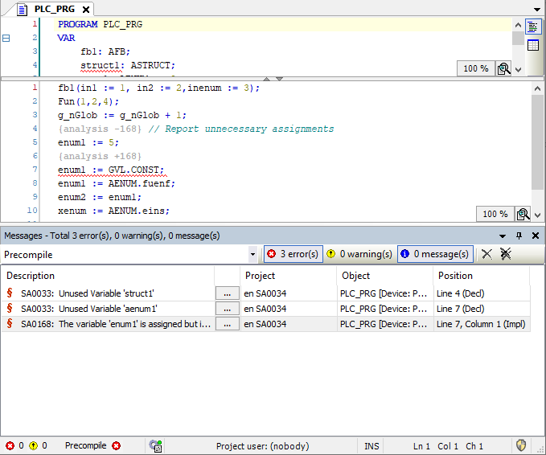

# Displaying rule violations in the message view

1. Click **View → Messages**.

   * The message view opens.
2. In the message view, in the list box, select the **Precompile** category.

   * In this category, only the rule violations are displayed, which have been detected during precompile and after a successful compile, and which you can resolve with Quickfix. The  button provides the respective commands for this.

     

11.1

© Copyright 2026, CODESYS GmbH