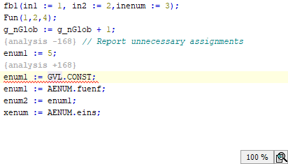

# Disabling the rule check for one line of code

In the settings, Rule 168 is enabled and a rule violation is displayed in the ST editor.

Requirement: At least one line has a wavy underline in the ST code, and the respective SA number is displayed in the message view.

1. Click the line of code with the wavy underline.

   * The  symbol is displayed.
2. You do not want to fix the error. Therefore you click the command **Ignore error/warning**.

   * Now the line of code is automatically provided with pragmas. The pragmas are used to prevent the line for the affected rule from being checked. An error message or warning is not issued.

     

The command to disable the rule check for the affected line of code is also available by means of the  button in the error message line in the message view.

11.1

© Copyright 2026, CODESYS GmbH