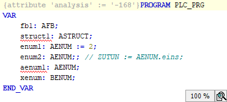

# Disabling the rule check for one programming object

In the settings, Rule 168 is enabled and a rule violation is displayed in the ST editor.

Requirement: At least one line has a wavy underline in the ST code, and the respective SA number is displayed in the message view.

1. Click the line of code with the wavy underline.

   * The  symbol is displayed.
2. You do not want the programming object to be checked with the specified rule. Therefore you click the second command **Ignore error/warning globally for PLC\_PRG**.

   * The declaration of the object is now automatically provided with an attribute. The attribute is used to prevent the affected rule from being checked for the object. An error message or warning is not issued.

     

The command to ignore the message is also available by means of the  button in the error message line in the message view.

11.1

© Copyright 2026, CODESYS GmbH