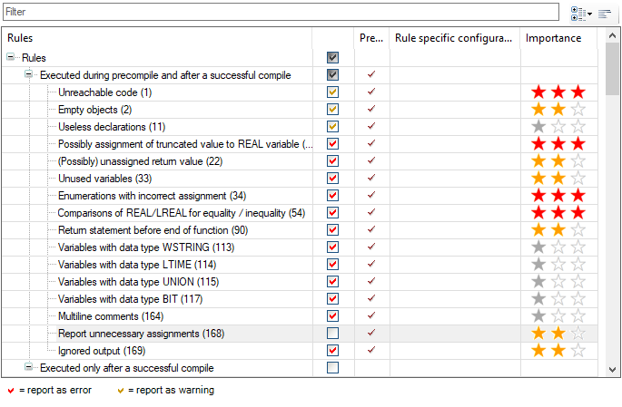

# Disabling the rule check in general

In the settings, Rule 168 is enabled and a rule violation is displayed in the ST editor.

Requirement: At least one line has a wavy underline in the ST code, and the respective SA number is displayed in the message view.

1. Click the line of code with the wavy underline.

   * The  symbol is displayed.
2. Click **Build → Static Analysis → Settings**. Switch to the **Rules** tab.

   * Rule 168 is disabled.

     

The command to globally disable the check is also available by means of the  button in the error message line in the message view.

11.1

© Copyright 2026, CODESYS GmbH