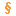

# Command: Run Static Analysis

Symbol: 

**Function**: The command starts the static analysis for the active application and displays the metrics for all POUs in a table.

**Call**: **Build → Static Analysis** menu

During the code analysis, CODESYS Static Analysis generates code just like the **Build → Generate Code** command. The results of the analysis are displayed as errors  and warnings  in the message view (**Build** category). The numbers refer to the corresponding [rules](_san_dlg_settings_sa_rules.html#_san_dlg_settings_sa_rules) as they are defined in the project settings. The syntax for the displayed messages is **SA<rule number>:<rule text>**.

11.1

© Copyright 2026, CODESYS GmbH