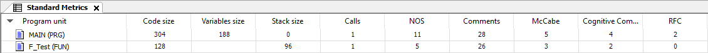
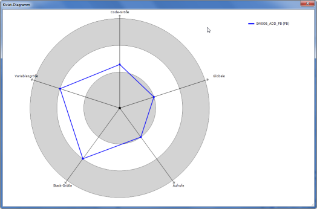

# Tab: Standard Metrics

**Example**

TIP:

In the [Dialog: Static Analysis Settings: Metrics](_san_dlg_settings_metrics.html#_san_dlg_settings_metrics) dialog, you can change the configuration of the metrics. You can disable calculation for a metric. And you can define limiting values for specific metrics.

NOTE:

If a value is outside of the configured upper and lower limits, then the field in the table is highlighted in red.

The following commands are provided in the context menu of the table:

|  |  |
| --- | --- |
| **Calculate** | Updates the values |
| **Copy Table** | Copies the table to the clipboard  The separator is a tab. |
| **Print Table** | Opens the default dialog to set up the print job |
| **Export Table** | Exports the table to a CSV file  The separator is a semicolon. |
| **Kiviat Diagram** | Requirement: At least three metrics are enabled which have been defined upper and lower limits.  Represents the metrics for the selected function block as a radar chart  This visualizes the quality of POU code with respect to a given standard.  Each metric is depicted as an axis with its origin at the center (value 0) which radiates outward into three concentric ring zones. The inner ring zone represents the value range below the lower limit defined for the metric. The outer ring represents the value range above the upper limit. The axes of the metrics are distributed uniformly around the circle.  The current values of the individual metrics on the axes are connected by a line. In the ideal case, the complete line is located in the middle zone. |
| **Configure** | Opens the table to select the desired metrics  This corresponds to the table in the project settings. |
| **Open POU** | Opens the editor with the POU |

**Example**

Example of a Kiviat diagram for five metrics

The name of the metric is displayed at the end of the respective axis and the name of the POU is displayed in the upper right corner of the diagram.

11.1

© Copyright 2026, CODESYS GmbH