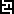

# Command: Show Cognitive Complexity for Current Editor

Symbol: 

**Function**: The command starts the static code analysis and calculates a measured value for the cognitive complexity of the code in the current editor. The dialog which opens visualizes the result and specifies the measured value sum in the title. The analyzed code is listed and displayed with the detected complexities.

**Call**: **Build → Static Analysis** menu

**Requirement**: A programming object in the ST implementation language is open in the editor.

11.1

© Copyright 2026, CODESYS GmbH