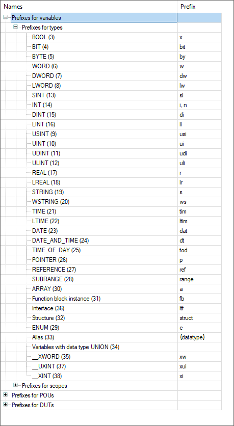
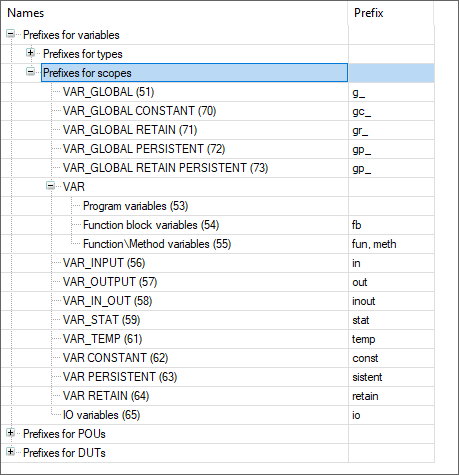
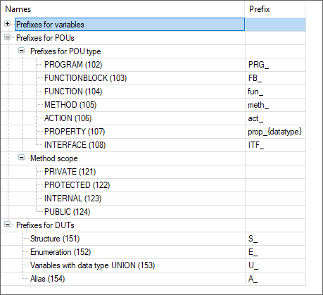
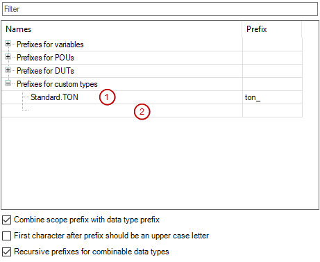

# Dialog: Static Analysis Settings: Naming Conventions

**Function**: In the dialog, you [define](_san_define_naming_conventions.html#_san_define_naming_conventions) the prefixes for the data types and scopes of variables, as well as prefixes for POUs and user-defined data types (DUTs). Static Analysis checks [compliance](_san_configuring_and_running.html#_san_configuring_and_running) with the naming conventions. When a convention is not observed, the static analysis reports an error message in the **Messages** view. For more information,see: [Configuring and Running Static Analysis](_san_configuring_and_running.html#_san_configuring_and_running)

**Call**:

* **Project → Project Settings** menu, **Static Analysis** category, **Open configuration dialog** link
* **Build → Static analysis → Settings** menu

**Requirement**:

* The CODESYS Static Analysis package is installed.
* A project is open.

The error messages are displayed in the following format:  **`NC <prefix of convention number> :`** `<message text>`. NC stands for "naming convention". For example, the error message **NC0102: Invalid name…** means a violation of naming convention 102 for POUs of type `PROGRAM`.

TIP:

You can use the [`'naming'`](../../../../../../api/crossBook?lang=en-US&virtualBookName=_san_attribute_naming.html#_san_attribute_naming) pragma to deactivate naming conventions for individual [identifiers](../../../SoMProg&topicID=D_SE_0083600). The identifiers can begin with anything, not necessarily with the prefix.

|  |  |
| --- | --- |
| **Filter** | Input field for strings to be searched for |

|  |  |
| --- | --- |
| Table with the naming conventions | |
| **Names** | Nodes and elements for which a prefix can be defined.  The number in parentheses after each element (for example, **PROGRAM (102)**) is the prefix convention number that is reported in the case of noncompliance with a naming convention. |
| **Prefix** | Input field of the prefix   * Multiple prefixes can be specified by means of comma separation.  Example:  **Prefix for POUs**, `PROGRAM (102)`: `prog, PRG_`  **Prefix for POUs**, `FUNCTION (103)`: `fun, FUN_` * Regular expressions (RegEx) are also possible for prefixes. To do this, an `@` has to be prepended.  Example:  The name has to begin with `x` and may contain one character from the scope `a-dA-D`: `@x[a-dA-D]`. * For variables of type **[Alias](../../../../../../api/crossBook?lang=en-US&virtualBookName=SoMProg&topicID=Alias-53AD6A64)** and POUs of type **[Property](../../../../../../api/crossBook?lang=en-US&virtualBookName=SoMProg&topicID=D_SE_0083410)**, the prefix can be defined with the placeholder `{datatype}`. |
| **Prefixes for variables** | Organizational node for all variables for which a prefix can be defined dependent on data type or scope. |
| **Prefixes for POUs** | Organizational node for all POU types and method scopes for which a prefix can be defined |
| **Prefixes for DUTs** | Organizational node for the DUT data types (structure, enumeration, alias, or union) for which a prefix can be defined |
| **Prefixes for custom types** | Organizational node for special custom types (particularly those from libraries)  You can extend the list with conventions: Click the blank space below it. In the **Input Assistant** dialog, specify the name of a custom type or select a custom type.  To delete a convention, select it and press the **Del** key.  Note: These conventions have priority over the prefixes which are defined with the attribute [`{attribute 'nameprefix' := '<prefix>'}`](_san_attribute_nameprefix.html#_san_attribute_nameprefix). |

|  |  |
| --- | --- |
| Options | |
| **First character after prefix should be an upper case letter** | : Static analysis reports an error for a variable when the first character of the variable name after the defined prefix is not an uppercase letter. |
| **Combine scope prefix with data type prefix** | : As its namespace, a variable must have the defined prefix followed by the defined prefix for its data type.  Example: The following prefixes are defined: `g_` for **VAR\_GLOBAL**, and `r` for the data type **REAL**.  The code analysis reports errors for global REAL variables that do not have the prefix `g_r`.  : If conventions for the namespace are specified for a variable, then these conventions are taken into account. As a result, any data type conventions are ignored.  Example: The following prefixes are defined: `g_` for **VAR\_GLOBAL**, and `r` for the data type **REAL**.  The code analysis reports exclusively errors for global `REAL` variables that do not have the prefix `g_`. |
| **Recursive prefixes for combinable data types** | : Variables of combined data types have to have compound prefixes that follow the defined naming conventions.  Example:  `ppiVariable : POINTER TO POINTER TO INT;`  The prefix `p` was defined for variables of data type `POINTER`, and the prefix `I` was defined for the data type `INT`.  Static analysis reports errors for all variables of type `POINTER TO POINTER TO INT` which do not have the prefix `ppi`.  `refaiVar : REFERENCE TO ARRAY[1..3] OF INT;`  The prefix `ref` was defined for the data type `REFERENCE TO`, the prefix `a` for an array, and the prefix `I` for the data type `INT`.  Static analysis reports errors for all variables of type `REFERENCE TO ARRAY[1..3] OF INT` which do not have the prefix `refai`. |

Example

The following naming convention corresponds for the most part to the recommendations which are described in CODESYS for the "identifiers".

  

Example

The naming convention (1) refers to the standard POU `TON`. As a result, declarations of the special library POU are checked for the prefix "ton\_". Click the blank space (2) to insert more naming conventions.

11.1

© Copyright 2026, CODESYS GmbH