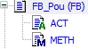

# SA0013: Declarations with the same variable name

Detects variables with names which are already used by other variables (for example, global and local variables with the same name). Variables are also detected whose names of functions, actions, methods, or properties are used in the same access range. Variables are also detected which are declared in a GVL in the **Devices** view or in the POUs pool. For this, however, the GVL of the **POUs** view have to be used in the application program.

Justification: The same names can be confusing when reading the code, and they can cause errors if the wrong object is accessed unintentionally. We recommend that you use naming conventions to avoid these situations.

PLCopen rule: N5 / N9

Importance: Medium

**Example**

```
VAR_GLOBAL
    xVar1 : BOOL;
    iVar3 : INT;
END_VAR
```

```
PROGRAM PLC_PRG
VAR
    xVar1 : BOOL;  // SA0013
    iVar3 : INT;   // SA0013
END_VAR
```

```
xVar1 := NOT GVL.xVar1;
iVar3 := iVar3 + INT#2;
iVar3 := GVL.iVar3;
```

**Output in the **Messages** view:**

*  **SA0013: Declaration of 'iVar1' hides symbol 'GVL.iVar1'**
*  **SA0013: Declaration of 'xVar3' hides symbol 'GVL.xVar3'**

**Example**

The `FB_Pou` function block has the `ACT` action, the `METH` method, and local variables with the same names.



```
FUNCTION_BLOCK FB_Pou
VAR
    ACT : UINT;  // SA0013
    METH : BYTE; // SA0013
END_VAR
```

```
PROGRAM PLC_PRG
VAR
    fbPou : FB_Pou;
END_VAR
```

```
fbPou();
```

**Output in the **Messages** view:**

*  **SA0013: Declaration of 'ACT' hides symbol 'FB\_Pou.ACT'**
*  **SA0013: Declaration of 'METH' hides symbol 'FB\_Pou.METH'**

11.1

© Copyright 2026, CODESYS GmbH