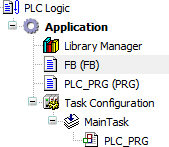

# SA0165: Tasks calling other POUs than programs

Detects tasks that call function blocks or functions instead of a program

Justification: This rule is part of the PLCopen Coding Guidelines. Therefore, compliance is also checked in CODESYS. We do not see any problems with data consistency in CODESYS if tasks would call POUs other than programs. However, problems can occur if the code is to be ported to other platforms.

Importance: Low

PLCopen rule: CP16

Tasks are inserted below the task configuration. The POUs to be called are configured in the tasks. The POUs must be the **Program** type. The **Function block** and **Function** types are not permitted.

**Example**

11.1

© Copyright 2026, CODESYS GmbH