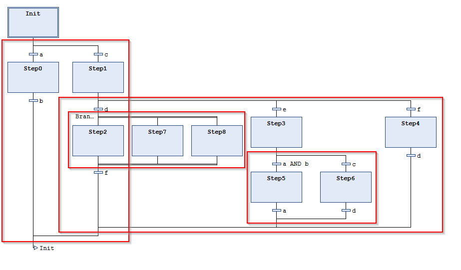

# Metric: Number of SFC branches

**Categories**: Testability, Maintainability

Number of alternative and parallel branches of a POU of the SFC (sequential function chart) implementation language

**Example**

The above code snippet in SFC has 4 branches: 3 alternative branches and 1 parallel branch

11.1

© Copyright 2026, CODESYS GmbH