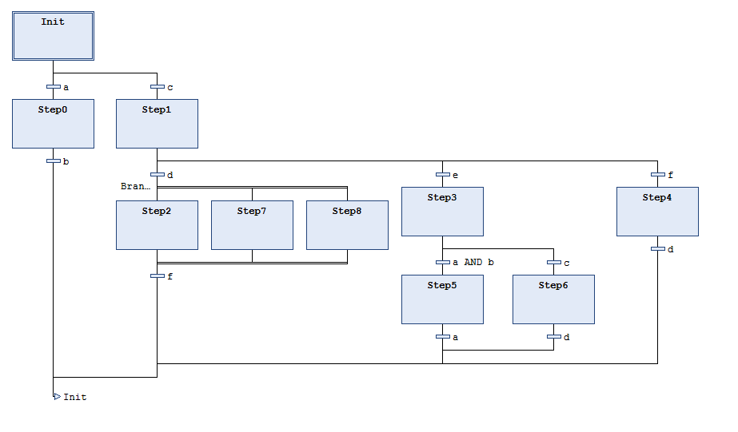

# Metric: Number of SFC steps

**Category**: Maintainability

Number of steps in a POU in SFC (sequential function chart)

Only the steps are counted which are contained in the POU programmed in SFC. Steps are not counted which are in the implementations of actions or transitions called in POUs.

**Example**

The code snippet in SFC has 10 steps.

11.1

© Copyright 2026, CODESYS GmbH