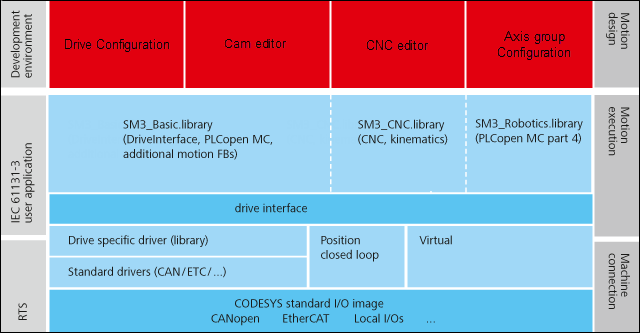

# Components of CODESYS SoftMotion

CODESYS SoftMotion is a software package which is used as a development and runtime environment for motion control. It is outlined as follows:

* **Drive configuration**: The drive configuration provides an editor for you to set the structure and configuration of the drive hardware by means of the CODESYS user interface. At this time, an instance of an IEC function block is created to represent the drive. This function block communicates automatically with the drives without additional effort from the IEC programmer. It is responsible for transmitting the updated data.

  To control the drives, the IEC program can address a drive by means of the function blocks of the SoftMotion libraries. Alternatively, you could also develop your own function blocks for this purpose. The set values (for position, velocity, acceleration, etc.) are written cyclically by these function blocks.

  Note: The CODESYS SoftMotion Light product is part of the standard installation of CODESYS. It provides the capability of commanding the axes. In this way, CODESYS defines only the target position only and waits for the response from the axis controller. The axis controller is responsible for the motion planning. A coordinated movement of multiple axes by CODESYS is not possible.
* **Cam editor**: In the cam editor, you can describe a cam graphically or by means of tables. CODESYS generates from this a global instance of a data structure which describes the cam. This is passed to the application where the applicable POUs can access it.
* **CNC editor**: In the CNC editor, you can generate multidimensional movements. You can create the CNC path with a text editor (according to DIN 66025) or with a graphical editor. As an alternative to the text editor, you can also work in a simplified tabular view.
* **Axis group configuration**: An axis group defines the relationships between multiple mechanically dependent axes which collectively position and orient a tool or tool plate in the space. With the configurator, you select and configure the kinematics to be used. Moreover, you can assign the SoftMotion axes.
* The `SM3_Basic` library is a basic library for all SoftMotion applications. Specifically, it contains the following:

  + PLCopen function blocks according to the PLCopen standard

    With these function blocks, you can control single-axis movements or master/slave movements of two axes (electric cam, electric gear boxes).
  + Additional FBs that are not covered by PLCopen functionalities
  + Help functions: For example for handling files or for error messages
* The `SM3_CNC` library is based on the `SM3_Basic` library. In addition to the function blocks for kinematic transformations, it provides all POUs which are required to generate, execute, and display CNC motion. It also provides function blocks for path preprocessing and path reconstruction.
* The `SM3_Robotics` library contains function blocks according to PLCopen Part 4 for robotics and additional function blocks. The included `SM3_Transformations` library contains the supported kinematic transformations.
* The **Drive interface** is part of the `SM3_Basic` library and is responsible for communication between the IEC program and the drives. For the supported drives, CODESYS SoftMotion provides libraries which implement this drive interface.

TIP:

See also the descriptions of the application examples.

15.0

© Copyright 2026, CODESYS GmbH