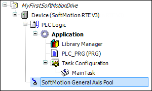

# Overview

The SoftMotion drive interface is a standardized interface that you use for linking, configuring, and addressing the drive hardware within an IEC program. By mapping different hardware to one interface, you can exchange drives easily and reuse IEC programs. The interface couples the drives to the I/O mapping and is responsible for updating and transmitting the required motion data to the drive control.

**The drive interface consists of the following components:**

* Device description of the SoftMotion devices to their representation in the device tree
* Libraries which are referenced in the device description that extend or overload the basic function blocks of `AXIS_REF_SM3` according to the requirements of the specific drive types
* Libraries which contain the function blocks for acyclic reading and writing of data to wrap standard functions for the fieldbus driver

If you use a SoftMotion PLC, such as CODESYS SoftMotion Win, then the base libraries are automatically linked in the Library Manager. These kinds of controllers provide a **SoftMotion General Axis Pool**. This is where you can insert free drive units.

15.0

© Copyright 2026, CODESYS GmbH