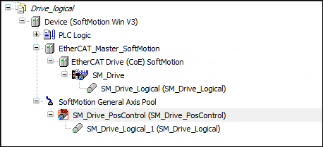

# Adding a logical drive

Requirement: A SoftMotion controller is inserted into the project.

1. Select a drive unit in the device tree.
2. Click the **Add Device** button.

   * The device is added to the device tree.

     

     Double-clicking the device opens the corresponding device editor.

15.0

© Copyright 2026, CODESYS GmbH