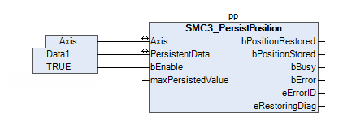

# Persisting the axis position of a multi-turn absolute encoder with a physical axis

Requirement: The axis has a multi-turn absolute encoder.

Use the `SMC3_PersistPosition` function block to make the position of the physical axis persistent. The respective program runs in the motion task.

1. Create an instance of the `SMC3_PersistPosition` function block for the axis.

   * `pp: SM3_BASIC.SMC3_PersistPosition;`
2. Extend the program of the motion task so that a call of the `SMC3_PersistPosition` instance is implemented there.

   * Call implemented in CFC:

     

     The function block is called in cycles with the motion task. The `SMC3_PersistPosition` instance performs the restoring of the saved position during the startup operation. In normal operation, the function block saves the actual position in the respective data structure.

15.0

© Copyright 2026, CODESYS GmbH