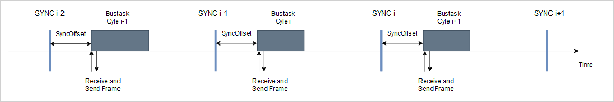

# When are the actual values received?

The actual position (`<DriveA>.fActPosition`) is received at the beginning of the current bus task cycle. It is the actual position of the drive at the time of the previous EtherCAT SYNC event.

In bus task cycle i, the EtherCAT frame which was sent in the previous bus task cycle i-1 is received. This frame contains the actual position which has been latched by the drive at SYNC event i-2.

15.0

© Copyright 2026, CODESYS GmbH