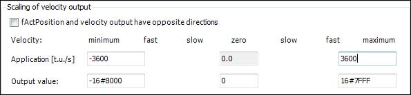

# Control of the axis position by means of SM\_Drive\_PosControl

1. Add a position-controlled axis of type `SM_Drive_PosControl` below **SoftMotion General Axis Pool** in the device tree.
2. Now you set the velocity values that are sent to the actuator. For this purpose, you need to know the maximum velocity in application units and the corresponding raw value of the transferred data. In this example, the maximum velocity is achieved by the output of the value `16#7FFF`, which corresponds to a velocity of 10 turns per second. This also corresponds to 3600 degrees per second according to the settings.

   * Settings:

     

15.0

© Copyright 2026, CODESYS GmbH