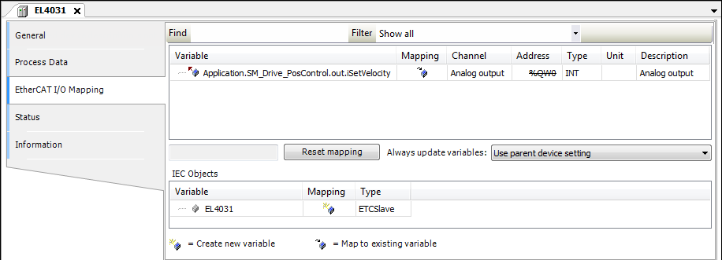

# Mapping of variables to inputs and outputs

Map the variables with the axis data to the I/O modules. The available cyclic data of the axis are located in the data structures `in` and `out`. You can establish this connection in the device editor of the input and output device either programmatically or directly.

1. Connect the output (set speed) to the EL4031 device. Open the device in the editor and click the **EtherCAT I/O Mapping** tab. Assign the variable `out.iSetVelocity` of the axis to the output. In the case of a 32-bit output, `out.diSetVelocity` is used.

   * Mapping:

     
2. In order for control enable, quickstop, and limit switch to operate, the corresponding inputs of `SMC_PosControlInput` have to be defined by the values of the drive. The outputs of `SMC_PosControlOutput` have to be transmitted to the drive (see description below). If the drive does not support quickstop, for example, then `SM_Drive_PosControl.in.bDriveStartRealState := TRUE` has to be set and `SM_Drive_PosControl.out.bDriveStart` can be ignored. In this example, `bDriveStartRealState` and `bRegulatorRealState` have to be set in the application.

```
SM_Drive_PosControl.in.bDriveStartRealState := TRUE;
SM_Drive_PosControl.in.bRegulatorRealState := TRUE;
```

15.0

© Copyright 2026, CODESYS GmbH