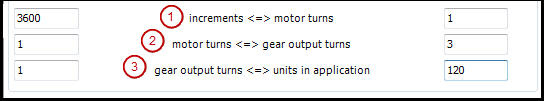

# Tab: Scaling/Mapping

On this tab, you can define the relationship between technical units (for example, millimeters or degrees) and the drive units (increments). Depending on the device description, the setting options are displayed simplified (parameter `bHiresMode = TRUE`), and/or scaling for linear motors may also be possible (parameter `IsLinearMotor = TRUE`). If necessary, you can also influence the mapping of cyclically transmitted drive objects to IEC variables.

Scaling

|  |  |
| --- | --- |
| **Invert direction** | : The direction of rotation is reversed. The motor gets the specified values with opposite signs. |
| **Precision (decimal digits)** | Requirement: The device description specifies a simplified configuration dialog (parameter `bHiresMode = TRUE`). In this case, the hidden settings get the default value of `1`.  Number of decimal places for the user units of the increments to be scaled and transferred. For example, `3` corresponds to a precision of 103. |
| **increments <=> motor turns** | Number of increments that correspond to a given number of motor turns. You can see the parameter on the **Configuration** tab of the device editor. |
| **motor turns <=> gear output turns** | Number of motor turns that correspond to a given number of gear output turns. |
| **gear output turns <=> units in application** | Number of gear output turns that correspond to a unit in the application. |

**Example of a comprehensive configuration**

In the sample configuration, a drive that has 3600 increments for a motor turn is scaled so that the technical units of the application are straight angular degrees.

Mapping

|  |  |
| --- | --- |
| Note: These parameters are not available for Drive\_PosControl. | |
| **Automatic mapping** | : IEC parameters that affect the drive are automatically mapped to the corresponding inputs and outputs of the device. After deactivation of the option, the mapping can be edited manually. To do this, change the address or type of the inputs and outputs to the displayed parameter list that was created according to the device description file. |

15.0

© Copyright 2026, CODESYS GmbH