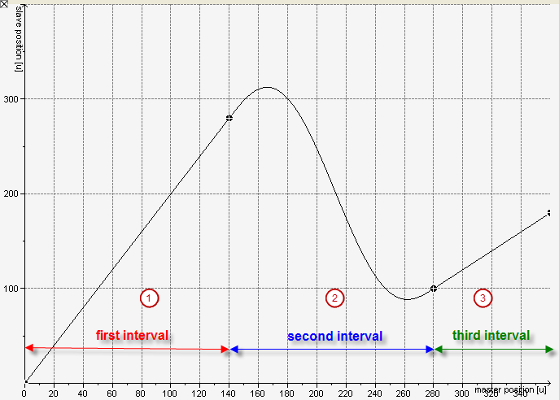

# Definition of a SoftMotion Cam

A cam describes the functional dependency of one drive (slave) on another drive (master). The relationship is described by a continuous function (or curve) that maps a defined range of master values to slave values. To be more precise: After dividing the master axis into suitable segments, the graph of these functions can be represented on each of these intervals by a line or a 5th degree polynomial.

**Example**

The master values are applied to the horizontal axis and the slave values to the vertical axis in the cam graph.

**In the example, the master values are between 0 and 360. This range is divided into three intervals:**

* (1) First interval: [0, 140]
* (2) Second interval: [140, 280]
* (3) Third interval: [280, 360]

The function (graph) is linear in the first and third intervals and its graph is displayed as a line. As a result, its first derivative (slope) is constant and all higher derivatives are 0.

In the second interval, the graph is described by a 5th degree polynomial. Therefore, its first derivative is a 4th degree polynomial, its second derivative (curvature) is a 3rd degree polynomial, and its third derivative is a 2nd degree polynomial, etc.

When the function describes the movement of the slave depending on the position of the master, its first derivative corresponds to the velocity of the slave and the second derivative to its acceleration.

When you keep this physical interpretation in mind, it is obvious that the mapping has to be continuous. This means that its graph is not allowed to have any jumps. In particular, the continuity also has to be fulfilled at each point where two intervals meet. Furthermore, the continuity in general is also required by the first and second derivative. (In fact, these three continuity conditions at the start and end points of an interval determine the coefficients of the 5th degree polynomial inserted between two straight segments.

Moreover, you may add tappets (binary switches) to the cam at any position. In this way, you can create cam tables which contain tappets only. The slave position is then set to zero over the entire master value range.

15.0

© Copyright 2026, CODESYS GmbH