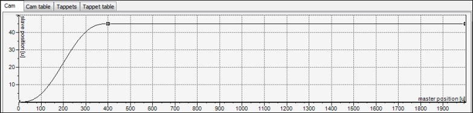

# Changing the path with the graphical editor

1. Open the **Rotary table** cam in the editor.

   * The [Cam](_sm_obj_cam_table_cam.html#_sm_obj_cam_table_cam) tab is visible.
2. Check the curve in the graphical editor.

   * Representation:

     

15.0

© Copyright 2026, CODESYS GmbH