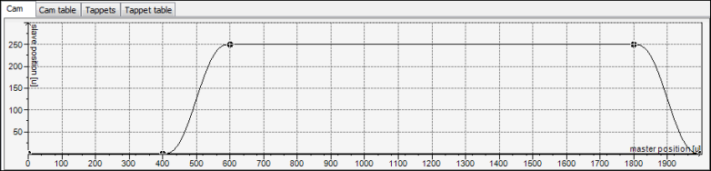

# Changing the path with a cam table

1. Open the **Vertical axis** cam in the editor.

   * The **Cam** tab is visible.
2. Check the curve in the graphical editor.

   * Representation:

     

TIP:

In practice, the curves of the different cams are defined frequently as overlapping in order to save on cycle time. In the example above, the vertical axis could already begin the movement while the rotary table is still in motion (for example, at X: 350).

15.0

© Copyright 2026, CODESYS GmbH