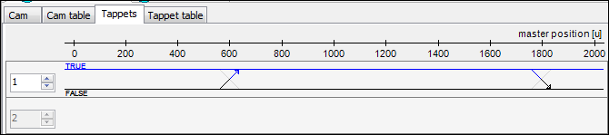

# How to define switch points

Use switch points to trigger events depending on the master position. For example, this can be the setting of an output or the calling of a function block.

These instructions use the example from the [How to create a cam](_sm_cam_creating_a_cam.html#_sm_cam_creating_a_cam) chapter to demonstrate how to define switch points. In this example, the tappet starts and stops the welding process.

1. Open the **Vertical axis** cam in the editor.

   * The **Cam** tab is visible.
2. Check the result.

   * 

TIP:

You can also change the values for **Positive pass** and **Negative pass** by clicking the respective end of the  crosshairs.

TIP:

Note that you can also set the switch points on the [Tappet table](_sm_obj_cam_table_tappet_table.html#_sm_obj_cam_table_tappet_table) tab. This editor provides you with the same options, but in tabular form.

15.0

© Copyright 2026, CODESYS GmbH