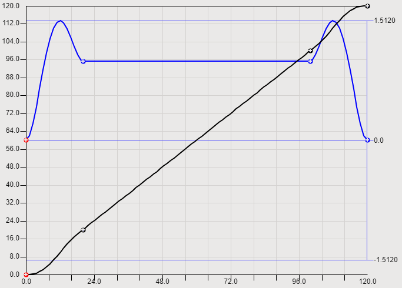
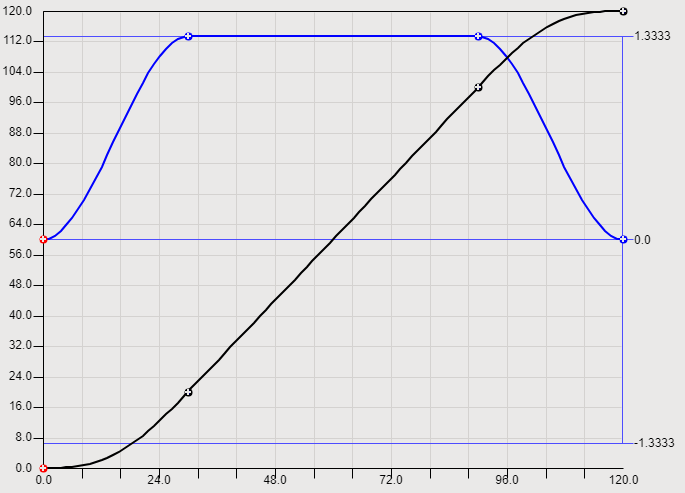

# Implicit and explicit boundary conditions

An implicit boundary condition defined with `BoundImplicit` makes sure that the transition to the adjacent segment is as smooth as possible. To do this, the boundary condition of the adjacent segment needs to be explicitly defined using the `Bound` method. So if the left boundary condition of a segment is implicit, then the right boundary condition of the previous segment has to be explicit. Conversely, if the right boundary condition is implicit, then the left boundary condition of the subsequent segment has to be explicit.

The most common use case is presumably that only the right boundary conditions of the segments are explicitly specified, as in the example above. Due to the implicit left boundary conditions, the segment transitions are automatically as smooth as possible and there are no gaps in the definition area. The following example is a simple case where it is helpful to deviate from this approach:

The slave axis should travel at a constant velocity from position 20 to 100:

```
camBuilder.Append(
    SMCB.Line(
        SMCB.Bound(20, 20),
        SMCB.Bound(100, 100)));
```

Before and after this, a `Poly5` segment is used for acceleration and deceleration:

```
camBuilder.Append(
    SMCB.Poly5(
        SMCB.BoundImplicit(),
        SMCB.BoundImplicit()));
camBuilder.Append(
    SMCB.Line(
        SMCB.Bound(20, 20),
        SMCB.Bound(100, 100)));
camBuilder.Append(
    SMCB.Poly5(
        SMCB.BoundImplicit(),
        SMCB.Bound(120, 120, 0)));
```

The cam defined in this way has unwanted acceleration and deceleration phases in the Poly5 segments (velocity in blue):



To avoid this, it is sufficient to adjust the master position in the segment of type `Line` (for example, that of the left boundary from 20 to 30 and that of the right boundary from 100 to 90):

```
...
camBuilder.Append(
    SMCB.Line(
        SMCB.Bound(30, 20),
        SMCB.Bound(90, 100)));
...
```



It is not necessary to adjust the segments of type `Poly5` because they are automatically added to the line segment as smoothly as possible due to the boundary conditions defined using the `BoundImplicit` function.

15.0

© Copyright 2026, CODESYS GmbH