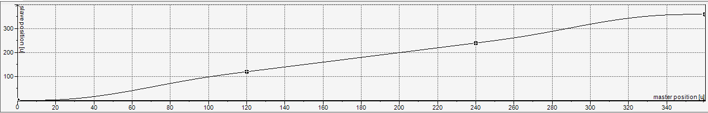

# Using the CamBuilder function block (as of SM 4.17.0.0)

The following cam is created by default when a cam object is created in the device tree:



The cam consists of three fifth-degree polynomials with the following four boundary values:

| X | Y | V | A |
| --- | --- | --- | --- |
| 0 | 0 | 0 | 0 |
| 120 | 120 | 1 | 0 |
| 240 | 240 | 1 | 0 |
| 360 | 360 | 0 | 0 |

To create this cam programmatically, an instance of the `CamBuilder` function block is first declared:

```
VAR
    camBuilder : SMCB.CamBuilder;
END_VAR
```

In the implementation part, the `CamBuilder` instance first has to be initialized. Three segments of type `Poly5` can then be added using the `Append` method:

```
camBuilder.Init();
 
camBuilder.Append(
    SMCB.Poly5(
	SMCB.BoundImplicit(),
	SMCB.Bound(120, 120, 1)));
camBuilder.Append(
    SMCB.Poly5(
	SMCB.BoundImplicit(),
	SMCB.Bound(240, 240, 1)));
camBuilder.Append(
    SMCB.Poly5(
        SMCB.BoundImplicit(),
        SMCB.Bound(360, 360)));
```

The polynomials are defined via the left and right boundary conditions. In the example, the `BoundImplicit` function is always used for the left boundary. As a result, the right boundary condition of the previous segment is applied. If the `BoundImplicit` function is used as the left boundary for the first segment, then it starts at zero: in this example, with Poly5 segment at (X, Y, V, A) = (0, 0, 0, 0).

When the `MC_CamTableSelect` and `MC_CamIn` function blocks are used, the cam defined in the `CamBuilder` function block finally has to be converted into an `MC_CamRef`. There are two ways to do this, depending on where the CamBuilder is called:

* Calling the CamBuilder in the bus task:

  First, the declaration part must be extended by the corresponding instances:

  ```
  VAR
      ...
      camRef : MC_CAM_REF;
      aCamSegments : ARRAY[1..3] OF SMC_CAM_SEGMENT;
  END_VAR
  ```

  Then the function block instance `MC_CAM_REF` is initialized and written using the `Write` method of the `CamBuilder` function block.

  ```
  SMCB.InitCamRef(camRef, ADR(aCamSegments), XSIZEOF(aCamSegments));
  camBuilder.Write(camRef);
  ```
* Calling the CamBuilder in another task (multitask, multicore):

  First, a multitask/multicore-safe instance of the cam is created in a GVL, which is accessed by both the bus task and the CamBuilder task.

  ```
  VAR_GLOBAL
      safeCam : SMCB.CAM_REF_MULTICORE_SAFE;
  END_VAR
  ```

  Then the creation of the cam in the other task is started from the bus task.

  + To determine in the bus task when the new cam was written in the other task, the program remembers the `CamId` in `STATE_INIT_ONLINE_TABLE_MULTITASK` before the cam is created.
  + Then the creation of the cam is started in the other task in the `STATE_START_CREATE_ONLINE_TABLE_MULTITASK` state.
  + Then, the created cam is read in the `STATE_READ_ONLINE_TABLE_MULTITASK` state.

  ```
  PROGRAM BUS_TASK
  VAR
      state : UDINT;
      error : SMC_ERROR;
      camIdBeforeCreate : UDINT;
      camSegments: ARRAY[0..99] OF SMC_CAM_SEGMENT;
      camRef: MC_CAM_REF;
  END_VAR
  VAR CONSTANT
      STATE_INIT_ONLINE_TABLE_MULTITASK : UDINT := 0;
      STATE_START_CREATE_ONLINE_TABLE_MULTITASK : UDINT := 10;
      STATE_READ_ONLINE_TABLE_MULTITASK : UDINT := 20;
      STATE_ERROR : UDINT := 1000;
  END_VAR

  CASE state OF
  STATE_INIT_ONLINE_TABLE_MULTITASK:
      camIdBeforeCreate := GVL.safeCam.CamId;

      state := STATE_START_CREATE_ONLINE_TABLE_MULTITASK;

  STATE_START_CREATE_ONLINE_TABLE_MULTITASK:
      CamBuilderTask.BuildCam := TRUE;

      state := STATE_READ_ONLINE_TABLE_MULTITASK;

  STATE_READ_ONLINE_TABLE_MULTITASK:
      IF CamBuilderTask.Error THEN
          error := CamBuilderTask.ErrorId;
          state := state + STATE_ERROR;
      ELSIF GVL.safeCam.CamId <> camIdBeforeCreate THEN
          error := GVL.safeCam.GetCopy(
              camRef:= camRef,
              pCamSegments:= ADR(camSegments),
              arraySize:= XSIZEOF(camSegments));

          IF error = SMC_NO_ERROR THEN
              state := state + 10;
          ELSE
              state := state + STATE_ERROR;
          END_IF
      END_IF
  END_CASE
  ```

  In the CamBuilder task, the multitask/multicore-safe cam is written by calling `CamBuilder.WriteMulticoreSafe()`:

  ```
  PROGRAM CamBuilderTask
  VAR_INPUT
      BuildCam : BOOL;
  END_VAR
  VAR_OUTPUT
      Error : BOOL;
      ErrorId : SMC_ERROR;
  END_VAR
  VAR
      camBuilder : SMCB.CamBuilder;
  END_VAR

  IF BuildCam THEN
      BuildCam := FALSE;

      camBuilder.Init();
      camBuilder.Append(SMCB.Poly5(SMCB.BoundImplicit(), SMCB.Bound(120, 120, 1)));
      camBuilder.Append(SMCB.Poly5(SMCB.BoundImplicit(), SMCB.Bound(240, 240, 1)));
      camBuilder.Append(SMCB.Poly5(SMCB.BoundImplicit(), SMCB.Bound(360, 360)));
       
      Error := camBuilder.IsErrorPending(errorID=> ErrorId);

      IF NOT Error THEN
          ErrorId := camBuilder.WriteMulticoreSafe(GVL.safeCam);
          Error := ErrorId <> SMC_NO_ERROR;
      END_IF
  END_IF
  ```

15.0

© Copyright 2026, CODESYS GmbH