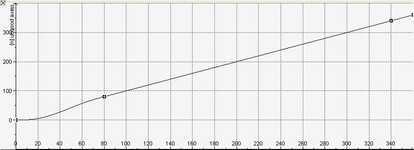
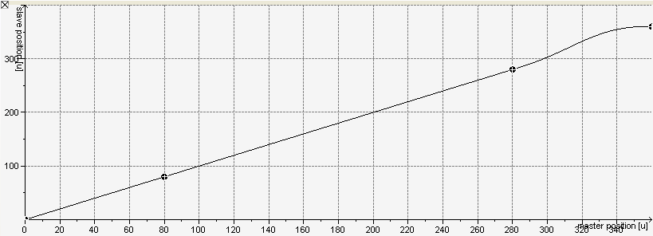
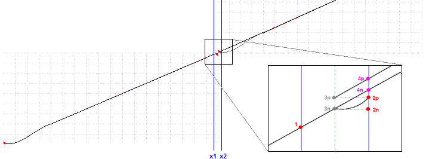
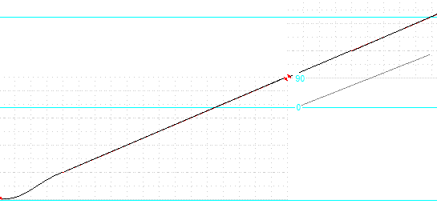

# Switching Between Cams

**In principle, you can switch between different cams at any time. However, you should consider some points:**

* In the cam editor, the position of the slave is defined uniquely as the function value of the cam function. This function is defined in the master value range and can be expressed as follows:

  `SlavePosition = CAM( MasterPosition )`
* Because the current position of the master drive usually deviates from the master value range, you need to scale the master position in the definition range of the cam function in order to represent a valid argument:

  `SlavePosition = CAM( MasterScale*MasterPosition + MasterOffset )`
* In a similar way, you need to scale the function value (the slave position) if the start of the cam in the mode `Absolute` would lead to a jump:

  `SlavePosition = SlaveScale*CAM( MasterPosition ) + SlaveOffset`
* You may have to apply both scaling values, which results in the following:

  `Slaveposition = SlaveScale*CAM( MasterScale*Masterposition + MasterOffset ) + SlaveOffset`
* The appropriate values for scaling and offset parameters can vary from period to period.
* **Switching between cams can be done in three ways:**

  + Start the second cam via a second instance of `MC_CamIn` with `BufferMode = MC_BUFFER_MODE.Buffered`, `StartMode = relative`, `MasterAbsolute = FALSE`, and `SlaveAbsolute = FALSE`.

    IMPORTANT:

    As of CODESYS SoftMotion version 4.17.0.0
  + Start of the new cam by assigning `MC_CamIn.CamTableID` to the new cam (no restart of the `MC_CamIn` function block required).

    **This variant is recommended if the following points apply to your use case:**

    - All of the following cams should be executed relatively with `MasterAbsolute = FALSE` or `SlaveAbsolute = FALSE`.
    - The new cam should start exactly at the end of the previous one.
    - No other parameters are changed (example: `SlaveOffset`).

      IMPORTANT:
      * The jump, which is explained in the following example for periodic cams and `SlaveAbsolute = FALSE`, does **not** apply to this variant because the next cam is placed exactly at the end positions of the previous cam.
      * The new cam is placed exactly at the end of the previous cam only if the switch to the new cam is done in the same cycle when the previous cam reports `EndOfProfile = TRUE`.
  + Start of the new cam by restarting the `MC_CamIn` function block.

    This variant is recommended if parameters have to be changed for the correct function of the new cam (for example, `SlaveOffset` from the following example). The restrictions of the following example apply.

**Example**

In the following example, it switches from `CAM1` to `CAM2`:

`CAM1` consists of a 5th order polynomial followed by two line segments.

`CAM2` consists of two line segments followed by one 5th order polynomial.

**When switching between both cams, you should consider the following:**

* To prevent jumps, the values of velocity and acceleration at the end point of the first cam should agree with the values at the starting point of the second cam. In the example, this condition is fulfilled because the same velocity (=1) and acceleration (=0) is assigned to the end point of `CAM1` and the starting point of `CAM2`.
* You can start the second cam in `Relative` mode when you have defined the start position of the slave as 0. However, the first cam has to be running in `non-periodic` mode. Otherwise, if `CAM1` were periodic, then the `Relative` setting would result in a jump.

The magnification shows the transition from `CAM1` to `CAM2`. The blue lines mark the evaluations of the cam functions at the master positions `x1` and `x2`.

Now, we will look at the unfavorable case of `periodic`:

|  |  |
| --- | --- |
| `MasterAbsolute := TRUE; SlaveAbsolute := FALSE;` |  |
| `CAM(x1, CAM1, PERIODIC:=TRUE);` | The call starts an evaluation of the cam at the master position `x1`, which is less than the end position of the master of `CAM1`. Then `CAM1` is evaluated by default and yields point `1` as the position for the slave. |
| `CAM(x2, CAM1, PERIODIC:=TRUE);` | For the following call of the module, the master position `x2` is outside of the master value range of `CAM1`, whose limit is marked by the green dashed line and agrees with the horizontal axis of the point `3p`. Therefore, the `EndOfProfile` is set. Because `CAM1` was started in `periodic` mode, its restart occurs at the end of the value range, which finally yields the point `2p` as the result of the module call. |
| `CAM(EXECUTE:=FALSE);` | Switch to the new cam |
| `CAM(x2, CAM2, PERIODIC:=TRUE);` | Second evaluation at master position `x2`. This time, the new `CAM2` is evaluated. After `CAM2` is started in `Relative` mode, the current slave position (`2p`) is added as offset to the image of the cam function of `CAM2`. This moves the starting point of its graph to the point `3p` and its evaluation at the master position `x2` yields the point `4p`, and therefore an unfavorable jump. |

Select the `non-periodic` mode in order to prevent jumps:

|  |  |
| --- | --- |
| `MasterAbsolute := TRUE; SlaveAbsolute := FALSE;` |  |
| `CAM(x1, CAM1, PERIODIC:=FALSE);` | The call starts an evaluation of the cam at the master position `x1`, which is less than the end position of the master of `CAM1`. Then `CAM1` is evaluated by default and yields point 1 as the position for the slave. |
| `CAM(x2, CAM1, PERIODIC:=FALSE);` | For the following call of the module, the master position `x2` is outside of the master value range of `CAM1`, whose limit is marked by the green dashed line and agrees with the horizontal axis of the point `3n`. Therefore, the `EndOfProfile` is set.  Because `CAM1` was started in `non-periodic` mode, slave position (`2n`) assigned to master position `x2` is identical to the position of the slave upon reaching the end of the value range of `CAM1` (`3n`). |
| `CAM(EXECUTE:=FALSE);` | Switch to new cam. |
| `CAM(x2, CAM2, PERIODIC:=FALSE);` | Second evaluation at master position `x2`. This time, the new `CAM2` is evaluated. After `CAM2` is started in `Relative` mode, the current slave position (`2n`) is added as offset to the image of the cam function of `CAM2`. This moves the starting point of its graph to the point `3n` and its evaluation at the master position `x2` yields the point `4n`, which is on the specific line through the points `1` and `3n`. |

To start the cam in `Absolute` mode, you need to make sure that the slave is in an appropriate start position. If the value range of the master agrees with the period of the slave, then switching between cams does not have any complications, regardless of whether the cams are periodic or not.

In the example above, you can start `CAM2` in `Absolute` mode when the periods of the master and slave agree with the master value range of `CAM2` (each is 360°).

If not, for example when the period of the slave is `270°` (indicated by the light blue line), then the `Absolute` option is not permitted without taking additional actions.

In this case, the slave is at 90° when switching from `CAM1` to `CAM2`. Starting `CAM2` in `Absolute` mode causes a jump to 0° (indicated by a gray line).

However, the jump can be prevented by setting the slave offset to the appropriate value of 90°.

15.0

© Copyright 2026, CODESYS GmbH