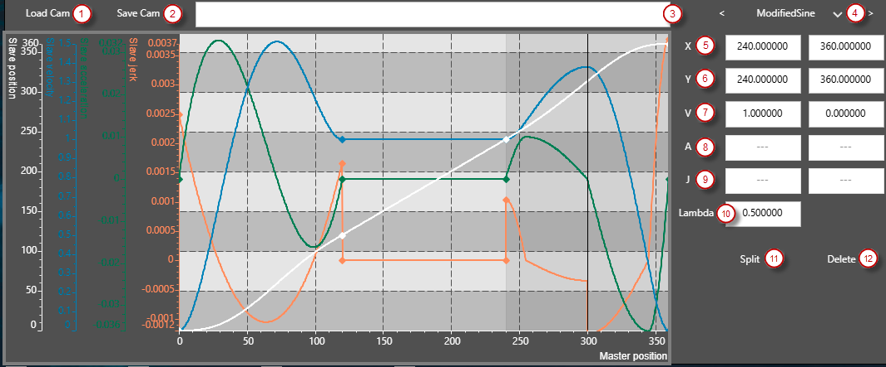

# Cam editor in online mode

In online mode, the individual segments of the cam can be selected in the graph. The segment editor on the right-hand side can be used to add and delete segments, as well as to adapt the boundary conditions of the selected segment.

|  |  |
| --- | --- |
| (1) Load Cam | Loads the configured cam into the editor |
| (2) Save Cam | Saves the edited cam |
| (3) Status bar | Displays status messages |
| (4) Segment selection | A segment can be selected using the arrows. The segment type can be changed via the list box. |
| (5) Master position | The master position on the left and right edge of the segment |
| (6) Slave position | The slave position on the left and right edge of the segment. |
| (7) Slave velocity | The slave velocity on the left and right edge of the segment. Not editable for all segment types. |
| (8) Slave acceleration | The slave acceleration on the left and right edge of the segment. Not editable for all segment types. |
| (9) Slave jerk | The slave jerk on the left and right edge of the segment. Not editable for all segment types. |
| (10) Lambda parameter | Lambda parameter for the modified sine line. |
| (11) Split | Divides the selected segment into two segments. |
| (12) Delete | Deletes the selected segment. |

15.0

© Copyright 2026, CODESYS GmbH