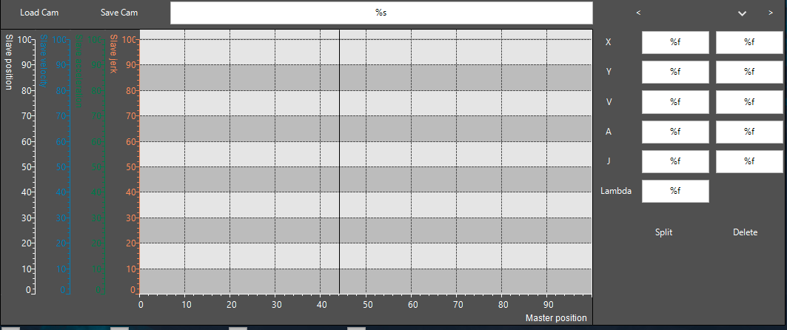

# Visualization Element: Online Cam Editor

The online cam editor is a visualization template that displays a cam in the visualization. With this element, you can modify the cam in online mode.

The visualization element is made available in a visualization template (**SMC\_VISU\_CamEditor**) of the `SM3_Basic_Visu` library. You find it in the visualization editor in the **Toolbox** view in the **SM3\_Basic\_Visu** tag.

The `SMC_Visu_CamEditor` is inserted into the visualization via a frame.

For more information about this visualization element, see: [Visualization Element: Frame](../../../../../../api/crossBook?lang=en-US&virtualBookName=CODESYS_Visualization&topicID=_visu_elem_frame).



In addition to the properties of the frame element, this template contains the following properties:

| Property | Description |
| --- | --- |
| **safeCam** | Reference to the cam to be edited |
| **showPosition** | Boolean variable for toggling the display of the position curve on and off |
| **showVelocity** | Boolean variable for toggling the display of the velocity curve on and off |
| **showAcceleration** | Boolean variable for toggling the display of the acceleration curve on and off |
| **showJerk** | Boolean variable for toggling the display of the jerk curve on and off |
| **showSelectedSegment** | Boolean variable for toggling the highlighting of the selected segment on and off |

The cam to be edited is transferred via an instance of the `SMCB.CAM_REF_MULTICORE_SAFE` function block.

```
PROGRAM PLC_PRG
VAR
    safeCam : SMCB.CAM_REF_MULTICORE_SAFE;
END_VAR
```

15.0

© Copyright 2026, CODESYS GmbH