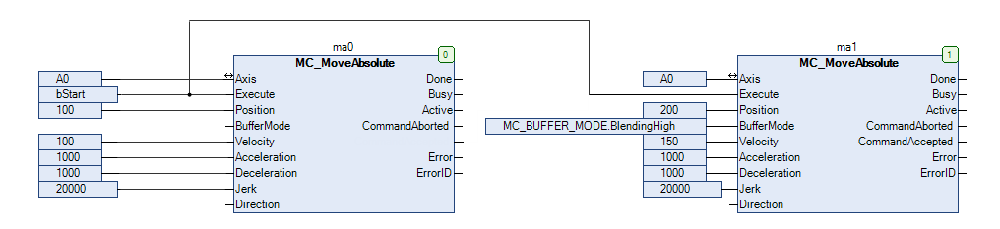
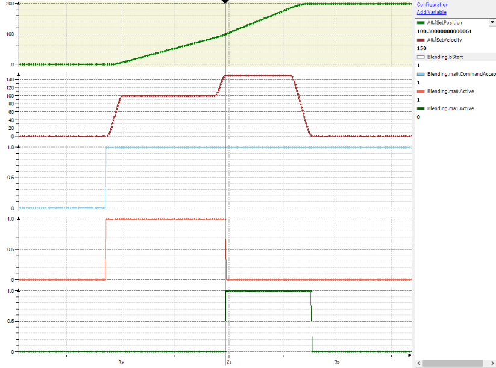
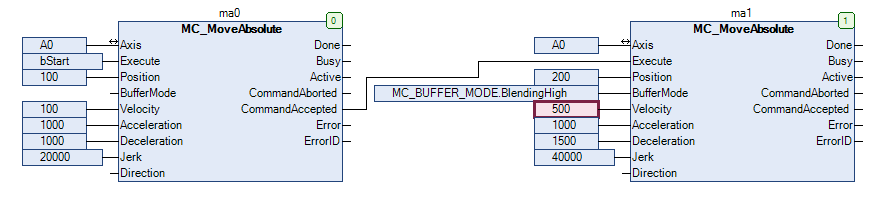
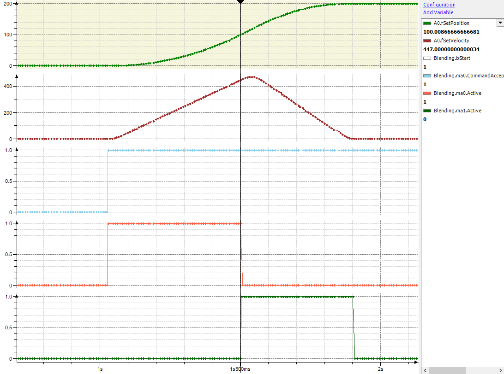

# Behavior in the Case of Blending

A basic property of the blending behavior of CODESYS SoftMotion is that the axis moves along the same positions during blending as during a buffered movement. The only difference is the velocity along these positions.

This is obvious for simple cases. See the following example for this:

There are cases in which the property of traversing the same positions by the axis independently of the buffer mode influences the effective blending velocity between the two movements. This is the case, for example, if the above example is modified so that the maximum velocity of the second movement is so high that it cannot be reached at the blending position. According to the rules described in PLCopen, the blending velocity should be 500 u/s. However, to achieve this velocity at position 100 u, the axis would have to reverse, move in the negative direction to a position less than 0 u, and then accelerate to 500 u/s. Instead, in such cases the effective blending velocity is limited to the maximum velocity that can be achieved without reversal and position overshoot. In this example, the maximum velocity is 447 u/s.

**The following rules for the effective blending velocity result from the property that the buffer mode does not change the driven positions:**

* If the blending velocity cannot be reached without position overshoot, then the effective blending velocity is the next possible velocity that can be reached without overshoot (see example above).

  Note: The effective blending velocity can be higher or lower than the blending velocity.
* If the direction at the beginning of the second movement is opposite to the direction of the first movement, then the effective blending velocity is set to 0. This prevents the position from overshooting in the direction of the first movement beyond its target position.
* If the path of the second movement is too short to allow deceleration from the blending velocity to standstill, then the effective blending velocity is adjusted. It is set to the maximum velocity that allows for safe braking to a standstill on the path of the second movement.
* In the case of modulo axes, the effect of the input `Direction` of `MC_MoveAbsolute` is not affected by blending to a second movement. This means that the target position of the first movement is always in the same modulo period, regardless of whether or not a blending movement follows.
* In the case of modulo axes and a second movement of type `MC_MoveAbsolute`, the blending velocity does not affect the modulo period of the target position of the second movement when `Direction` = `fastest` is used. This means that the same target period is selected regardless of whether the second movement is commanded with `Buffered` or `Blending`.

15.0

© Copyright 2026, CODESYS GmbH