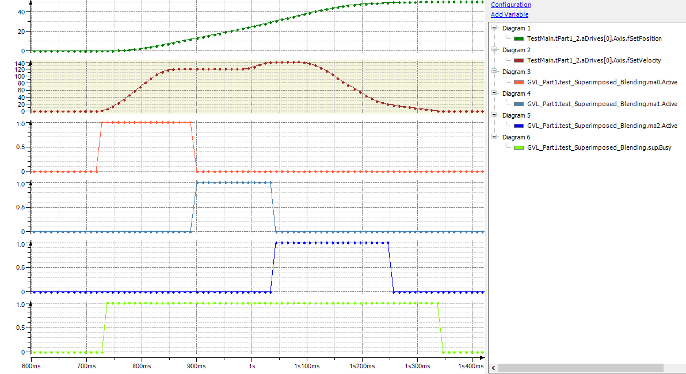

# Before CODESYS SoftMotion version 4.17.0.0

If an `MC_MoveAbsolute` assigned with buffered mode or a blending mode is commanded while an `MC_MoveSuperImposed` / `MC_HaltSuperImposed` is active, then the resulting end position depends on the status of `MC_MoveSuperImposed` / `MC_HaltSuperImposed` at the time when the `MC_MoveAbsolute` is active. If `MC_MoveSuperImposed` / `MC_HaltSuperImposed` is still active at this time, then the resulting end position is the sum for the position of `MC_MoveAbsolute` and the distance of `MC_MoveSuperImposed` / `MC_HaltSuperImposed`. On the other hand, if `MC_MoveSuperImposed` / `MC_HaltSuperImposed` is no longer active at this time, then the resulting end position is the position of `MC_MoveAbsolute` without the distance of `MC_MoveSuperImposed` / `MC_HaltSuperImposed`. In a similar way, the resulting velocity of `MC_MoveVelocity` depends on the status of `MC_MoveSuperImposed` / `MC_HaltSuperImposed` when `MC_MoveVelocity` is active.

The curve below shows an `MC_MoveSuperImposed` (**sup** function block) parallel to three absolute movements with blending buffer mode `BlendingHigh`. The first and second movements are commanded with a velocity of 100 u/s with the **ma0** and **ma1** function blocks. The **ma2** function block commands the third movement with a velocity of 120 u/s. The first target position is 10 u, the second is 25 u, and the third is 40 u. The velocity of the superimposed movement is 20, and the distance is 10. The resulting position is 50 u: the position of the last absolute movement plus the distance of `MC_MoveSuperimposed`.

15.0

© Copyright 2026, CODESYS GmbH