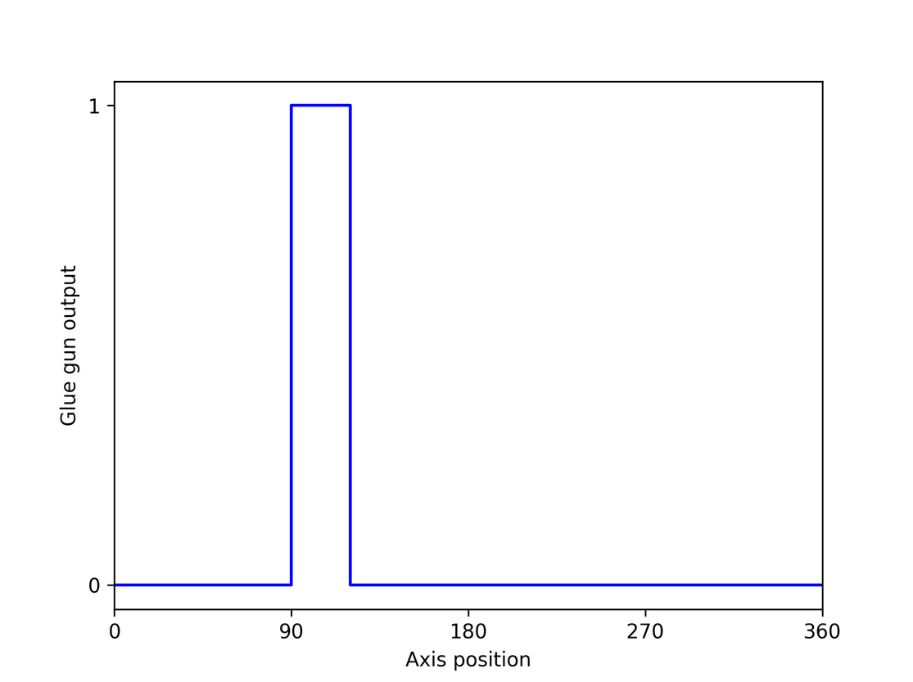
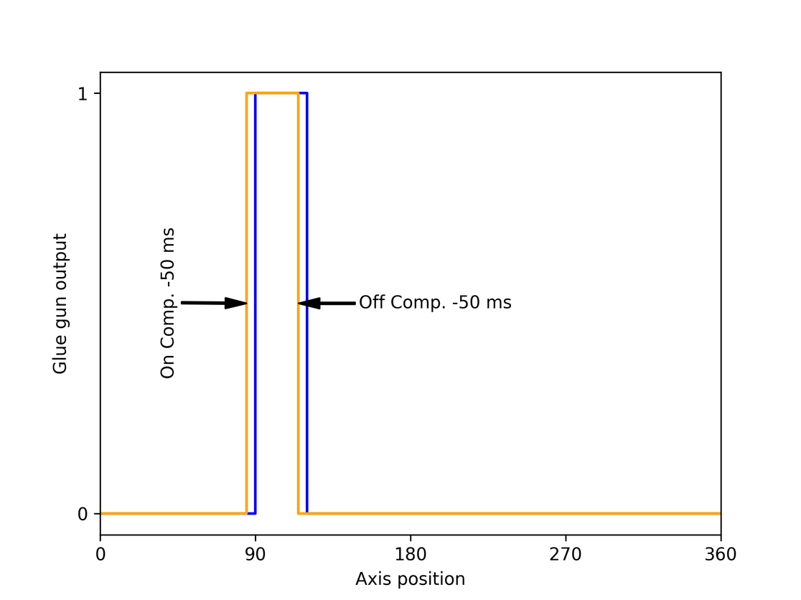

# Application example

Digital switch points are required, for example, to switch on a glue gun depending on the axis position. In the following example, the glue gun should apply adhesive to a product from position 90 to position 120.

A glue gun has a delay between switching on and applying glue. The same applies to switching off. An on/off compensation is therefore required so that the glue gun is switched on 50 ms before position 90 and switched off 50 ms before position 120.

15.0

© Copyright 2026, CODESYS GmbH