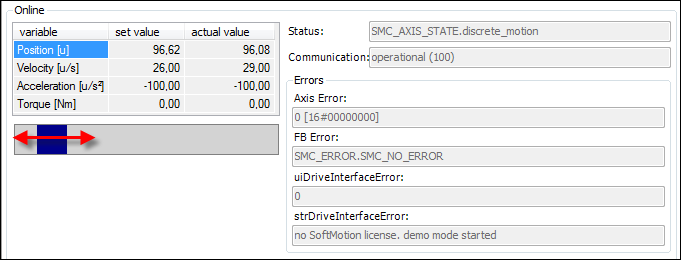

# Controlling the Movement of Single Axes

See the `PLCopenSingle.project` sample project in the installation directory of CODESYS under `..\CODESYS SoftMotion\Examples`.

This example shows how to control a drive by means of PLCopen standardized function blocks.

1. Insert a virtual drive named `Drive` in the device tree below **SoftMotion General Axis Pool**.
2. Open the **Drive** virtual axis in the editor.

   * In the **Online** part of the **General** tab, you see the axis motion.

     

15.0

© Copyright 2026, CODESYS GmbH