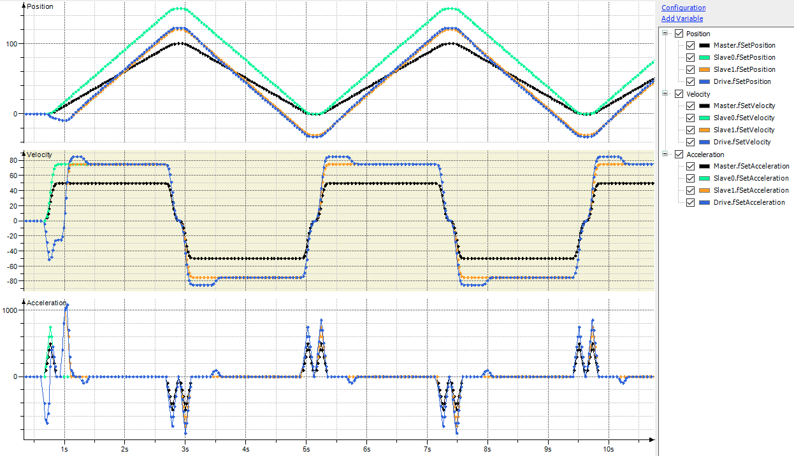

# Usage

The master axis (black in the trace diagram) moves continuously back and forth between position 0 and position 100 at a maximum velocity of 50 units per second.

An electronic gearbox (`MC_GearIn`) with a gear ratio of 2:3 converts the master movement to the `Slave0` axis (green in the trace diagram). The maximum velocity resulting from the gears is 75 units per second.

Then, a phase offset (`MC_Phasing`) of 30 units is applied to the `Slave1` axis (orange in the trace diagram). The velocity is identical to the `Slave0` axis, except for the ramp-in phase.

Finally, gear backlash compensation is used to bring the movement to the `Drive` axis (blue in the trace diagram). An unrealistically high value of 5 units is set for the gear backlash for demonstrative purposes. The diagram shows a compensating movement at the start of the movement and at each reversal of the direction of movement.

15.0

© Copyright 2026, CODESYS GmbH