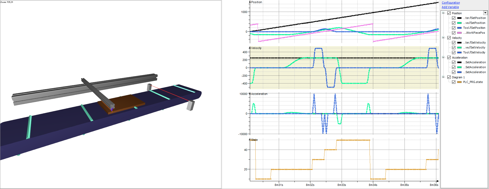

# Usage

Start the application. In the **Scene** Depictor object and in the trace, you can see how the synchronization between the master (workpiece on the conveyor belt) and the slave (saw) is performed.

15.0

© Copyright 2026, CODESYS GmbH