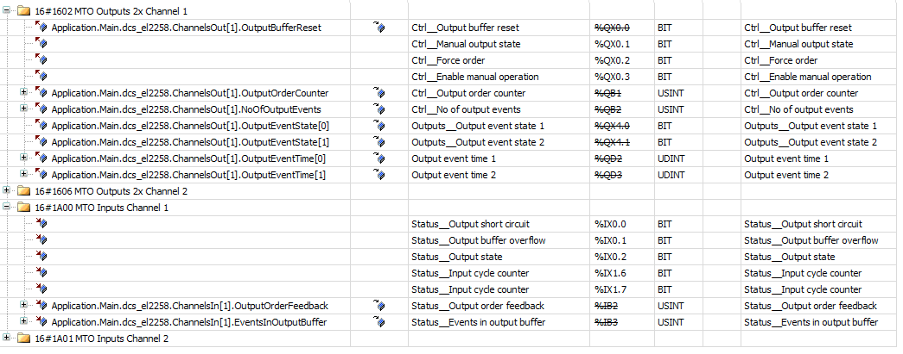

# DigitalCamSwitch\_EL2258

The function block works as follows: 

* The function block is initialized on a rising edge at the `Enable` input. In the `STATE_INIT_0` and `STATE_INIT_1` states, the `OutputBufferReset` signals of the EL2258 terminal are written and the `aLastEventIds` array is initialized. The ID of the last processed event for each track is saved in this array. This prevents an event from being transferred to the terminal multiple times.
* Once initialized (`STATE_ACTIVE`), all tracks are processed in turn, and the following logic is performed for each track:

  + Check whether the EL2258 terminal has already accepted the last commanded events (`ChannelsIn[channel].OutputOrderFeedback = ChannelsOut[channel].OutputOrderCounter`).
  + Loop through all events of the track. Only those events whose `ToggleEventId` is greater than the last ID processed are considered further. (Query `EventId_GreaterThan(event^.ToggleEventId, aLastEventIds[channel])`)

    See section: "Note on the event order".
  + Convert the `Duration` of the event into an EtherCAT timestamp and corresponding write of the `ChannelsOut[channel].OutputEventState` and `ChannelsOut[channel].OutputEventTime` outputs.
  + Abort the processing after a maximum of 5 events.
  + Notify the terminal that new events exists if at least one event has been found (`ChannelsOut[channel].OutputOrderCounter := ChannelsOut[channel].OutputOrderCounter + 1`).

**Note on the event order**

The events are returned by the `SMC_DigitalCamSwitch_HighPrecision` function block for each track in an array. The `SwitchNumber` and a `ToggleEventId` are returned for each event. This `ToggleEventId` is unique and ascending for each track.

For more information, see: SMC\_CAMSWITCH\_TOGGLE\_EVENT.

In the example, the `aLastEventIds[trackNo]` array stores for each track which `ToggleEventId` was last transferred to the terminal in a previous function block call. Because the `ToggleEventIds` are in ascending order, the next call will know exactly which events still need to be transferred.

Two details still need to be considered:

* Because it is not known at which `ToggleEventId` the events start, a `valid` flag is saved in the `EventId` data type in addition to the ID. For the `EventId_GreaterThan` comparison, this `valid` flag is taken into account accordingly.
* The `ToggleEventIds` have the 32-bit data type `UDINT` and can therefore, in principle, overflow with a respectively long runtime or high switching frequency. The value then goes from 2^32-1 back to 0. The comparison function `EventId_GreaterThan` also takes 32-bit overflows into account.

**PDO Mapping EL2258**

The `ChannelsOut` and `ChannelsIn` outputs of the `DigitalCamSwitch_EL2258` function block are connected to the respective I/O channels of the EL2258 terminal. The following image shows the mappings for Channel 1. Channel 2 is similar; only when accessing `ChannelsOut` and `ChannelsIn` the index is 2, not 1.

15.0

© Copyright 2026, CODESYS GmbH