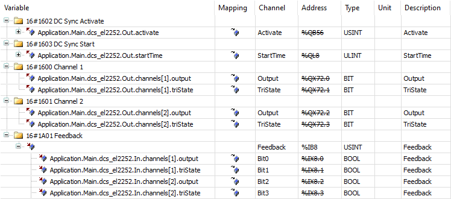

# **DigitalCamSwitch\_EL2252**

The basic principle is identical to `DigitalCamSwitch_EL2258`. The difference is in how the signals are written because the EL2252 terminal can program only one active event.

* First, the function block is initialized in `STATE_INIT`.
* Then `STATE_CHECK_FOR_EVENT` checks whether events from the `SMC_DigitalCamSwitch_HighPrecision` function block are pending.
* If an event is available, then the event must be programmed within two cycles:

  + The outputs and the EtherCAT timestamp are written in the first cycle. The `Activate` output is set to 0.
  + In the second cycle, the `Activate` output is set to 3 in `STATE_ACTIVATE_EVENT_IN_EL2252`. This activates the event in the terminal.
* In `STATE_WAIT_UNTIL_THE_INPUTS_MATCH_THE_OUTPUTS`, the system then waits until the event has been executed. The signals from the `Feedback` input of the terminal are used for this.

**PDO Mapping EL2252**

15.0

© Copyright 2026, CODESYS GmbH