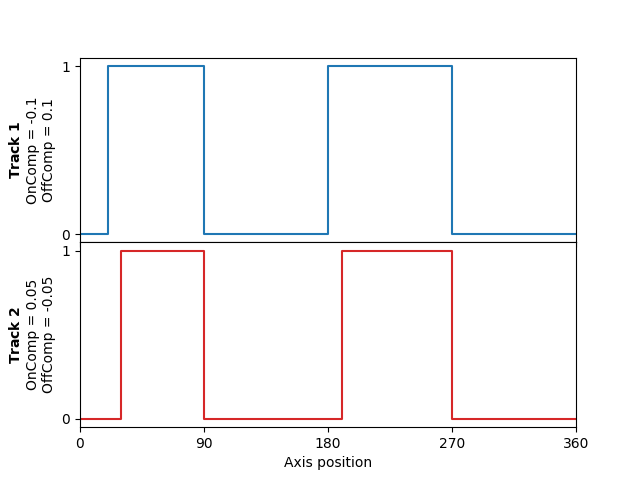

# **Main**

In the main program, four switches are configured (two on each track). The tracks also have different on/off compensations (`OnComp`, `OffComp`):

The program includes the necessary function block calls to activate a forecast for the axis and to move it constantly at 180°/s (\*), as well as for `SMC_DigitalCamSwitch_HighPrecision`, `DigitalCamSwitch_EL2258`, and `DigitalCamSwitch_EL2252`. Before starting the movement, the fieldbus must be fully powered up. Otherwise the events cannot be transmitted to the terminal.

(\*) Constant movement was chosen to keep the example simple and clear. However, the `SMC_DigitalCamSwitch_HighPrecision` function block works with all types of movements. For example, it also provides exact timestamps during an acceleration phase or with cams.

15.0

© Copyright 2026, CODESYS GmbH