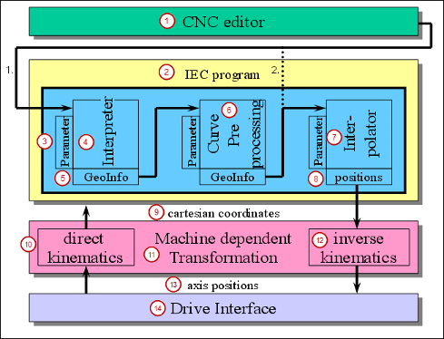

# SoftMotion software components of the CNC editor

|  |  |  |
| --- | --- | --- |
| (1) CNC editor | (2) IEC program | (3) Parameter |
| (4) Interpreter | (5) GeoInfo | (6) Path preprocessing |
| (7) Interpolator | (8) Path points | (9) Cartesian coordinates |
| (10) Direct kinematics | (11) Machine-specific transformation | (12) Inverse kinematics |
| (13) Axis position | (14) Drive interface |  |

15.0

© Copyright 2026, CODESYS GmbH