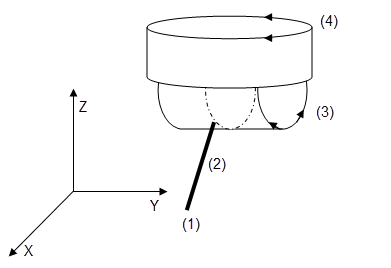
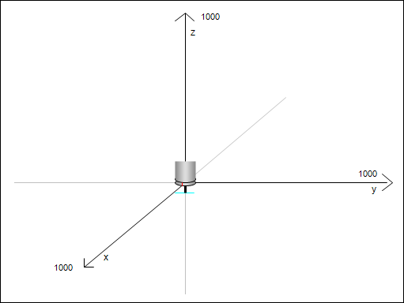

# 5-Axis Transformation

With the 5-axis transformation, you can control kinematics that consist of three linear spatial axes (X, Y, Z) and a tool head. The tool head consists of two axes that hold the tool. A tool axis rotates about the Z axis, and the tool tilts the others according to the following scheme.



Parameter: Length of `dTool` = Distance from the processing point (tool tip = TCP) to the rotary axis inclination.

**Control of the 5-axis transformation by five positional values:**

* X/Y/Z-position of the processing point (TCP) that is included in `pi.dX, pi.dY, pi.dZ`. Unit: Position units of the axes.
* Orientation of the tool by spherical coordinates (inclination and azimuth) that are included in `pi.dB` and `pi.dC`. Unit: Angular degrees.



**Zero position**

* The processing point (TCP) is located at the position (`0/0/-dTool`).
* The tool extends in the direction of the negative Z axis. The rotary axis inclination is positioned in such a way that rotating in the positive direction would move the tool in the direction of the positive X axis.

**Example**

For the movement N30, the inclination axis that first points in the X direction is rotated and it remains tilted in the negative X direction at the end of the movement.

```
N0 PB360 PC360 (set axis B and C in modulo mode 360)
N10 F10 FB100 FC100 (velocity in X/Y/Z: 10, in B and C 100)
N20 G0 X0 Y0 Z0 C0 B30  (start position)
N30 G1 X20 B-30 (target position)
```

For more information, see: [SMC\_TRAFO\_5Axes (FB)](../../../../../../api/crossBook?lang=en-US&virtualBookName=SM3_CNC&topicID=SMC_TRAFO_5Axes) and [SMC\_TRAFOF\_5Axes (FB)](../../../../../../api/crossBook?lang=en-US&virtualBookName=SM3_CNC&topicID=SMC_TRAFOF_5Axes)

15.0

© Copyright 2026, CODESYS GmbH