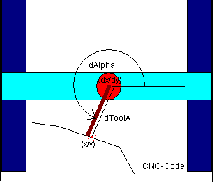
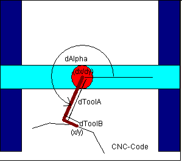
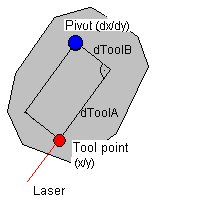

# Gantry System with Tool Offset

If the axis of the tool has an offset and does not coincide with the Z-axis of the gantry system, then the contact point of the tool does not agree with the X/Y/Z-position of the gantry system. If the Z axis cannot be rotated, then the resulting offset of the X and Y coordinates is constant and can be used directly for the standard gantry transformation.

**If the tool is rotated by the C axis (about Z), then the offset is not constant, but depends on the position of the C axis. In this case, one of two POUs can be selected, depending on the form of the tool:**

* `SMC_TRAFO_Gantry2Tool1`  and `SMC_TRAFOF_Gantry2Tool1`

  The tool points along the X axis rotated by `dAlpha` and has a length of `dToolA`.
* `SMC_TRAFO_Gantry2Tool2`  and `SMC_TRAFOF_Gantry2Tool2`

  The tool is partially in the direction of the X axis rotated by `dAlpha` (length: `dToolA`) and partially in the direction of the rotated Y axis (length: `dToolB`).

In the figure of the following example, the laser is attached with an offset in both the X direction and Y direction.

Instead of executing this one-dimensional transformation, the path can also be modulated with a tool offset. At this time, the tool approaches a straight line. The `SMC_ToolCorr` or `SMC_ToolRadiusCorr` function blocks are used for this. The difference between these two methods is the velocity of the tool point. If the modulation is used from `SMC_ToolCorr`, then the velocity of the rotational point is controlled according to the presets in the CNC program (F, E). The velocity of the tool point can fluctuate. If the one-dimensional transformation is used, then the velocity of the tool point is determined by the CNC program.

To calculate the orientation of the tool, the `SMC_CalcDirectionFromVector` POU is used.

15.0

© Copyright 2026, CODESYS GmbH