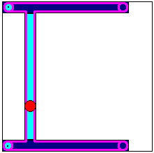
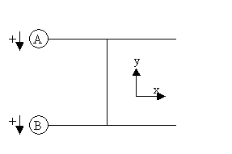
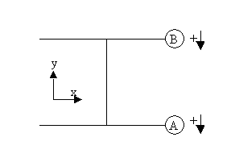

# H-Gantry with Stationary Axes

The kinematic configuration is similar to the gantry system, but the axes (drives) are firmly mounted. They move the tool holder by means of a belt.

Transformation by means of the `SMC_TRAFO_GantryH2` and `SMC_TRAFOF_GantryH2` POUs require the following axis configurations. Other configurations can be performed by exchanging x and y:

This transformation requires a special homing: Both axes have to be moved at the same velocity. If movement should be in the X direction, then drives A and B have to be moved, while they have to moved with reverse velocity for strictly an X-movement. For an X movement only, they have to be moved with an opposing velocity. If the homing is found, then the X and Y values calculated from the forward transformation POU are used as the offset (`dOffsetX` and `dOffsetY`).

15.0

© Copyright 2026, CODESYS GmbH