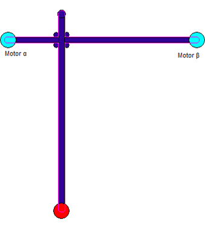
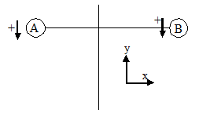
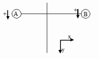

# T-Gantry with Stationary Axes

This kinematic system is similar to H-gantry systems. The drives here are also mounted stationary and the tool holder is moved by means of a belt.

The transformations that are executed by the `SMC_TRAFO_GantryT2` and `SMC_TRAFOF_GantryT2` POUs are designed for the following drive constellations:

Note that special homing is necessary for this transformation.

If you execute a movement in the X direction, then you have to move the A and B drives at the same velocity. If you execute strictly a Y movement, then the drives have to rotate in opposite directions. If the drive finds the homing position, then the X and Y values calculated from the forward transformation POU are used as the offset (`dOffsetX` and `dOffsetY`).

The `SMC_TRAFO_GantryT2_O` and `SMC_TRAFOF_GantryT2_O` function blocks execute the same calculation with the following constellation:

15.0

© Copyright 2026, CODESYS GmbH